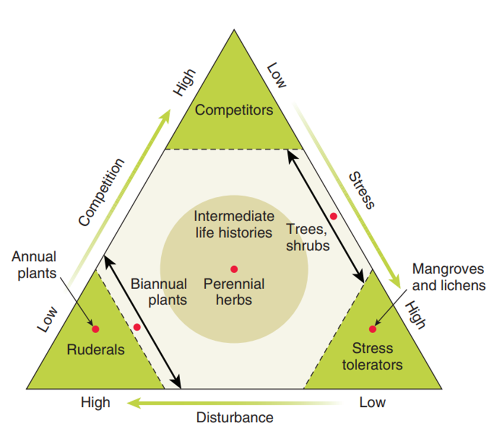
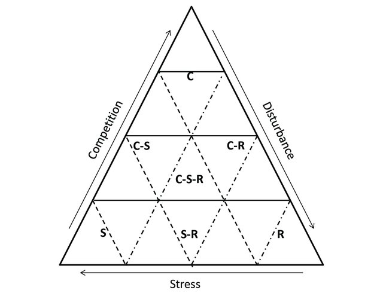

<!-- README.md is generated from README.Rmd. Please edit that file -->

# CSR - Species Distribution Modelling:

### A trait-based framework for mapping plant strategies and habitat suitability from environmental filters including stress and disturbance regimes

<figcaption>
<i><b>source:</b>
<a href="https://triyambak.org/free-resources/gate-life-sciences/pointer/5499">https://triyambak.org</a></i>
</figcaption>

# Background

Species distribution models (SDMs) have traditionally emphasized
climatic variables like temperature and precipitation, treating them as
proxies for the environmental constraints on species’ ranges. While
effective for capturing broad-scale patterns, this approach often
overlooks the ecological mechanisms that determine which species persist
at local/regional scale — especially the role of **chronic stressors**
and **recurring disturbances** as long-term habitat filters.

**Environmental stressors** such as *drought*, *cold/frost*, or
*nutrient limitation* impose persistent physiological constraints on
plant growth and survival. Meanwhile, **disturbance regimes** —
including *fire*, *flood/inundation*, *grazing/herbivory*, and *land-use
change* — shape ecosystems through repeated biomass removal or damage,
thus serve as long-term ecological forces, with , , and that species
must adapt to. As such, both stress and disturbance act as selective
filters that favor species with compatible survival strategies.

Under this perspective, Grime’s CSR theory (Grime 1977) categorizes
plant survival strategies based on trade-offs between stress,
disturbance, and competition. The model is a ternary diagram with three
primary strategies at its extremities:

- **Competitors (C)** dominate in resource-rich and productive habitats,
  stable environments (e.g., tropical forests). They invest resources in
  relatively rapid and continued growth of large individuals which
  allows for resource preemption.
- **Stress-tolerators (S)** persist in low-disturbance but resource-poor
  systems (e.g., deserts, alpine tundra). They are adapted to conditions
  of variable productivity in which extensive reserve tissues buffer
  from environmental variability.
- **Ruderals (R)** thrive in high-disturbance, low-stress systems (e.g.,
  post-fire grasslands). They invest a large proportion of resources in
  propagules, from which the population can regenerate despite repeated
  disturbances.

Simplified version of the CSR triangle.Arrows indicate increasing
importance foreach factor (competition, stress and disturbance) and
letters representcompetitive (C), stress tolerant (S) and ruderal (R).
Modified from Grime (1979) (Pulsford et al. 2014)

Based on the C, S, and R values of each species, plant ecological
strategy could be categorized into 19 types, including 3 primary (C, S,
and R), 4 secondary (CS, CR, SR and CSR) and 12 tertiary (C/CR, C/CS,
C/CSR, CR/CSR, CS/CSR, R/CSR, S/CS, S/CSR, S/SR, SR/ CSR, R/CR and
R/SR).

# Bayesian framework for modelling plant CSR strategy

We model plant ecological strategies in the CSR framework (sensu Grime)
as compositional data, using a **Bayesian Dirichlet regression** to
relate each species’ strategy to its environmental context, including
stress and disturbance regimes.  The input data consists of vectors
$\mathbf{y}_i=(C_{i},S_{i},R_{i})$, where $\mathbf{y}_i \in \Delta^{2}$
is a ternary vector representing the relative contributions of
**competitiveness (C)**, **stress-tolerance (S)**, and **ruderalism
(R)** for species $i$, with $\sum_k y_{ik} = 1$. We assumed these
compositions were drawn from a **Dirichlet distribution** with a
concentration parameter
$\boldsymbol{\alpha} = (\alpha_1,\alpha_2,\alpha_3)$ parametrised to
reflect environmental effects on both the **mean strategy** and the
**strength of environmental filtering**:

$$
\mathbf{y}_i \sim \text{Dirichlet}(\boldsymbol{\alpha}_s), \quad \text{with} \quad \boldsymbol{\alpha}_s = \phi_s \cdot \boldsymbol{\mu}_s
$$

The mean CSR strategy $\mu_s \in \Delta^2$ is modelled using a softmax
regression:

$$
\boldsymbol{\mu}_s = \text{softmax}(X_s \boldsymbol{\beta})
$$

where $X_s$ is a vector of environmental predictors (e.g., fire
intensity, drought duration) at site s, and $\boldsymbol{\beta}$ is a
matrix of regression coefficients. 

The precision parameter $\phi_s>0$ controls the strength of
environmental filtering: high $\phi_s$ corresponds to narrower
ecological filtering around $\mu_s$, while low $\phi_s$ indicates
broader compositional spread. Optionally, $\phi_s$ could be held
constant across sites or modelled as a log-linear function of separate
covariates:

$$
\log \phi_s = Z_s \boldsymbol{\gamma}
$$

where $Z_s$ may be the same or different covariates than $X_s$, with
corresponding coefficients $\boldsymbol{\gamma}$.

Ecological Interpretation

- $\boldsymbol{\mu}_s$: This is the **expected CSR strategy** under the
  environmental conditions at site $s$. It represents the **center of
  gravity** of the trait distribution — i.e., the strategy most favored
  by the environment. For example, a $\boldsymbol{\mu}_s$ close to the R
  vertex (Ruderal) indicates that fast-growing, short-lived species are
  selected for in that environment (e.g. frequent fire or disturbance).

- $\phi_s$: This is the **filtering strength** or **selectiveness** of
  the environment or **degree of specialisation** at site $s$. High
  $\phi_s$ values indicate **strong filtering**, where species must
  closely match $\boldsymbol{\mu}_s$ to persist — leading to **narrow
  CSR composition** (e.g. in extreme habitats like deserts or fire-prone
  systems). Low $\phi_s$ values indicate **weak filtering**, allowing
  **greater diversity** of strategies to coexist.

Model inference will performed using the R package brms (Stan) (Bürkner
2021).

### Functional suitability mapping for SDM

Once the model fit:

1.  For each grid cell in the landscape, predict:

- $\boldsymbol{\mu}(x) = \text{softmax}(X_x \boldsymbol{\beta})$
- $\boldsymbol{\phi}(x) = \text{exp}(X_x \boldsymbol{\gamma})$

2.  combine the two to compute the functional suitability for a focal
    species i with known CSR strategy $\mathbf{(C_i,S_i,R_i)}$: $$
    \text{Suitability}(x) \propto \text{DirichletPDF}(\mathbf{(C_i,S_i,R_i)} \mid \phi(x) \cdot \boldsymbol{\mu}(x))
    $$

This gives a species-specific functional filter map — even for species
with no distribution data. The functional suitability filter can then be
used as:

- a *prior* map for (hierarchical) macro-ecological models
- an environmental filter mask to refine a habitat suitability map
- a range map in absence of any other distributional map for the species

## References

Bürkner, Paul-Christian. 2021. “Bayesian Item Response Modeling in R
with brms and Stan.” *Journal of Statistical
Software* 100 (5): 1–54. <https://doi.org/10.18637/jss.v100.i05>.

Grime, J. P. 1977. “Evidence for the Existence of Three Primary
Strategies in Plants and Its Relevance to Ecological and Evolutionary
Theory.” *The American Naturalist* 111 (982): 1169–94.
<http://www.jstor.org/stable/2460262>.

